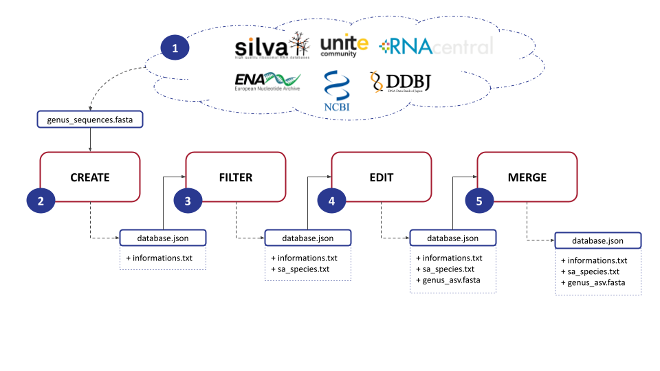

**Table of content**
- [Description](#description)
- [Package installation](#package-installation)
- [Usage](#usage)
    - [1.1. Retrieve fasta files from a general database](#11-retrieve-fasta-files-from-a-general-database)
    - [1.2. Create the initial database](#12-create-the-initial-database)
    - [1.3. Filter the sequences](#13-filter-the-sequences)
    - [1.4. Create SA taxons](#14-create-sa-taxons)
  - [2. Merge databases](#2-merge-databases)
- [Qiime example](#qiime-example)
- [References](#references)

# Description

This package allow to create ASV specific reference databases from unfiltered FASTA files. FASTA file supported:
- [ncbi: 'nt'](https://www.ncbi.nlm.nih.gov/nucleotide/)
- [ebi: 'ena'](https://www.ebi.ac.uk/ena/browser/home)
- [ddbj: 'arsa'](http://ddbj.nig.ac.jp/arsa/)
- [RNAcentral](https://rnacentral.org/)
- [UNITE](https://unite.ut.ee/repository.php)
- [Silva](https://www.arb-silva.de/)

It is mainly intended to be used by command line. However, some modules can be used inside python scripts. Most of the database creation is automatically done, only a few commands are left to the user.

CAUTION: this tool is not a pipeline but a set of modules.

# Package installation

The package is available on  [pypi](https://pypi.org/). It can be installed by the following command: 

```shell
pip install asvmaker
```

# Usage
ASVmaker is designed to be used by modules : 


### 1.1. Retrieve fasta files from a general database
The first step involves downloading a FASTA file for a specific genus of interest from a general database : Silva, Unite, RNAcentral, ENA, NCBI or DDBJ. This file contains the genomic data necessary for subsequent analysis.

If you work from the Silva or UNITE fasta file, we recommand to extract genus sequences with `grep -A 1 "Genus" filename.fasta`. By this, ASVmaker will process your data quicker. CAUTION : fasta file sequences from Silva are multiligned. Use the following script to flatten the sequence on one single line : [flatten.sh](samples/flatten.sh)


```shell
# The genus of interest
GENUS=$1
# The name of the database. Pick among : ncbi,ebi,ddbj,rnaCentral,silva,unite
DB=$2
# Fasta file to proceed
SEQ=$3
```


### 1.2. Create the initial database
Next, ASVmaker enables the creation of a genus-specific database by using the downloaded FASTA file. Each sequence lineage is verified by accession number through the European Nucleotide Archive API if possible and through the NCBI Entrez API if the ENA one doesn't match. Users must specify primers to be used during the simulation of the amplification process, allowing for precise targeting of the desired genomic regions and ASV creation.

```shell
#  INIT DATABASE
python3 -m asvmaker \
    -inf database/${DB}/${GENUS}_${DB}_info_create.txt \
    create \
    -i ${SEQ} \
    -db ${DB} \
    -fp fw_primer.fasta \
    -rp rv_primer.fasta \
    -fmt 5 \
    -rmt 5 \
    -o database/${DB}/${GENUS}_${DB}_create.json
```
### 1.3. Filter the sequences
To enhance the quality and specificity of the analysis, ASVmaker provides the functionality to filter out redundant amplicons and exclude unwanted taxonomy. Redundant amplicons are ASVs sharing the same taxonomy. Unwanted taxonomy or species that are not of interest (e.g. : “sp.” or “aff.”) can also be filtered out, ensuring a more focused analysis on the target genus. 

```shell
#  FILTER DATABASE
python3 -m asvmaker \
    -inf database/${DB}/${GENUS}_${DB}_info_filter.txt \
    filter \
    -i database/${DB}/${GENUS}_${DB}_create.json \
    -g1 ${GENUS} \
    -o database/${DB}/${GENUS}_${DB}_filter.json

#  EXPORT RESULTS
python3 -m asvmaker \
    -inf database/${DB}/${GENUS}_${DB}_info_exp1.txt \
    export \
    -i database/${DB}/${GENUS}_${DB}_filter.json \
    -sao database/${DB}/${GENUS}_${DB}_sa.txt 1
```

### 1.4. Create SA taxons

ASVmaker creates Shared Amplicon (SA) groups, which involve clustering identical ASVs which have different taxonomies. This grouping allows for a comprehensive understanding of the taxonomic diversity within the selected ASV, providing valuable precisions into the composition and dynamics of microbial communities.

```shell
#  EDIT DATABASE
python3 -m asvmaker \
    -inf database/${DB}/${GENUS}_${DB}_info_edit.txt \
    edit \
    -i database/${DB}/${GENUS}_${DB}_filter.json \
    -grp database/${DB}/${GENUS}_${DB}_sa_ext.txt \
    -o database/${DB}/${GENUS}_${DB}_edit.json

#  EXPORT RESULTS
python3 -m asvmaker \
    -inf database/${DB}/${GENUS}_${DB}_info_exp2.txt \
    export \
    -i database/${DB}/${GENUS}_${DB}_edit.json \
    -aop database/${DB}/${GENUS}_${DB}_asv.fasta
```

## 2. Merge databases

Moreover, ASVmaker offers the option to merge ASV specific databases from different general databases, providing flexibility to combine data from various sources. This merging process allows for a more comprehensive dataset, enabling comparative analysis and broader insights into the studied genus.

```shell
#  MERGE DATABASES
python3 -m asvmaker \
    -inf database/all/${GENUS}_info_merge.txt \
    merge \
    -i database/rnaCentral/${GENUS}_rnaCentral_edit.json \
    -sa1 database/rnaCentral/${GENUS}_rnaCentral_sa_ext.txt \
    -i2 database/unite/${GENUS}_unite_edit.json \
    -sa2 database/unite/${GENUS}_unite_sa_ext.txt \
    -o database/all/${GENUS}_merge.json

#  EXPORT RESULTS
python3 -m asvmaker \
    -inf database/all/${GENUS}_info_exp3.txt \
    export \
    -i database/all/${GENUS}_merge.json \
    -aop database/all/${GENUS}_asv.fasta
```

# Qiime example

When an ASVmaker specific database has been created, it is possible to use it as a complementary database
for Qiime2 ASV taxonomic identification.

Here, we present a method to use an ITS specific database created with ASVmaker on 38 fungus pathogen genera.
This method involves a first identification with Qiime2 and a complementary step with the ASVmaker specific database.

In order to run such analysis, 3 files are required (+ FASTQ to analyse):
- A UNITE classifier : [UNITE8.3_classifier.qza](https://github.com/colinbrislawn/unite-train/releases/download/8.3-qiime2-2021.11-demo/unite_ver8_99_all_10.05.2021.qza)
- The ASVmaker ITS specific database `phylo.fasta` file : [PathDB_BITS_2021.6-phylo.fasta](./samples/qiime_example/ref/PathDB_BITS_2021.6-phylo.fasta)
- A list of all the unique whole taxonomies for each genus in the ASVmaker specific database:
[Genus_Fungi_taxo.txt](./samples/qiime_example/ref/Genus_Fungi_taxo.txt)

A bash script ([ITS.sh](./samples/qiime_example/ITS.sh)) makes a taxonomic attribution with Qiime2 and completes the identification with the ASVmaker specific database. Then, the results are exported as a table for each sample. If the detected genus is in the genera list, a column `isPatho` gives details about it.
Columns description :
- **#OTU ID** : Qiime2 sequence identifier
- **Reads Count** : number of reads in the sample
- **Relative Abundance** : number of reads on total sum of reads in the sample
- **Kingdom,Phylum Class, Order, Family, Genus, Species** : UNITE taxonomy identification
- **Unite Confidence** : UNITE classifier identification confidence
- **isPatho** : taxon in pathogenes list
- **Specific DB Taxonomy** : taxonomy from ASVmaker specific database

**Results table example :**
| #OTU ID                          | Reads Count | Relative Abundance   | Kingdom  | Phylum        | Class              | Order            | Family                            | Genus               | Species                           | Unite Confidence   | isPatho | Specific DB Taxonomy                                        |
| -------------------------------- | ----------- | -------------------- | -------- | ------------- | ------------------ | ---------------- | --------------------------------- | ------------------- | --------------------------------- | ------------------ | ------- | ----------------------------------------------------------- |
| f369e7040d6a8ec809b813c86388be98 | 10696     | 0.2546545402599876   | k__Fungi | p__Ascomycota | c__Sordariomycetes | o__Glomerellales | f__Plectosphaerellaceae           | g__Plectosphaerella | s__Plectosphaerella_oratosquillae | 0.9858436283038672 | no      | URS00007C0054_145972_Colletotrichum_pisi                    |
| 21f34d539e27a351f59580aa39b530a9 | 7481      | 0.17811056616351603  | k__Fungi | p__Ascomycota | c__Sordariomycetes | o__Glomerellales | f__Plectosphaerellaceae           | g__Verticillium     | s__unidentified           | 0.9981024689843628 | yes     | URS0002135E36_27337_Verticillium_SA1                        |
| c6e89cb4cb1459d20e8b29086b6579e0 | 10275     | 0.2446312080377125   | k__Fungi | p__Ascomycota | c__Sordariomycetes | o__Glomerellales | f__Glomerellaceae                 | g__Colletotrichum   | s__Colletotrichum_coccodes        | 0.9982691073091507 | yes     | URS00001143FA_27358_Colletotrichum_coccodes                 |
| 23567ef88155066ea14693411a25e131 | 61        | 0.001452311794676444 | k__Fungi | p__Ascomycota | c__Dothideomycetes | o__Pleosporales  | f__Pleosporaceae                  | g__Alternaria       | s__Alternaria_angustiovoidea      | 0.7681297203386827 | yes     | URS00002006C5_474922_Colletotrichum_gloeosporioides_complex |
| 6cd9621117c8968bade94e1b2f69bd6b | 385       | 0.009166230179515261 | k__Fungi | p__Ascomycota | c__Sordariomycetes | o__Hypocreales   | f__Hypocreales_fam_Incertae_sedis | g__Acremonium       | s__Acremonium_furcatum            | 0.7784985803462298 | no      | URS00004BE307_27337_Verticillium_dahliae                    |
|                                  |             |                      |          |               |                    |                  |                                   |                     |                                   |                    |         |                                                             |

# References
Please cite : Plessis, C.; Jeanne, T.; Dionne, A.; Vivancos, J.; Droit, A.; Hogue, R. ASVmaker: A New Tool to Improve Taxonomic Identifications for Amplicon Sequencing Data. Plants 2023, 12, 3678. https://doi.org/10.3390/plants12213678